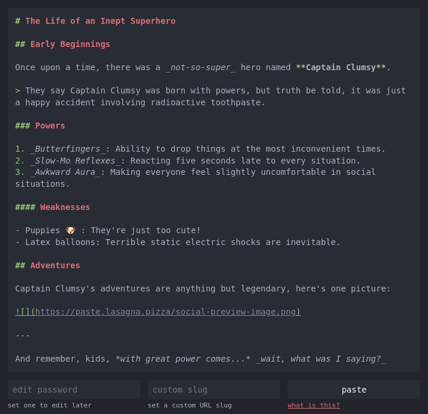

# paste

**paste** is a **simple markdown store**, like pastebin but it **renders as markdown**.

Live instance [paste.lasagna.pizza](https://paste.lasagna.pizza)

Example [paste.lasagna.pizza/example](https://paste.lasagna.pizza/example)




## Technology


### Dependencies

- Rails 7.1.1
- Ruby 3.2.1
- PostgreSQL

### Docker image

Image is published on build time and tagged, these can be found at [GitHub Packages](https://github.com/lasagnapizza/paste/pkgs/container/paste).

```shell
docker pull ghcr.io/lasagnapizza/paste:latest
```

### To install

Clone this respository:

```shell
git clone https://github.com/lasagnapizza/paste.git
```

Assuming you have Ruby and PostgreSQL up and running.

Install dependencies:

```shell
bundle install
```

Setup the database:

```
rails db:prepare
```

Run the web server:

```shell
rails s
```

Visit the app at http://localhost:3000


## Contributing

Pull requests are welcome. For major changes, please open an issue first to discuss what you would like to change.
